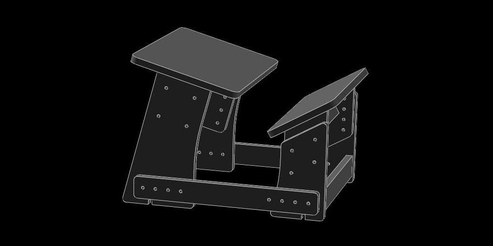

# коленный стул

(как у Лизы Симпсон) по мотивам коленного стула [Колосок](https://kolstul.ru/chertezhi-kolennogo-stula-delaem-stul-samostoyatelno/)

## детали из фанеры

|наименование|чертёж|количество|
|-|-|-|
|сиденье|seat.slvs|1
|регулировочная проставка задняя|seat-spacer.slvs|2
|боковина задняя|seat-side.slvs|2
|||
|упор для ног|rest.slvs|1
|регулировочная проставка передняя|rest-spacer.slvs|2
|боковина передняя|rest-side.slvs|2
|||
|распорка нижняя|strut-down.slvs|2
|распорка верхняя|strut-up.slvs|2
|||
|нижняя соединительная пластина|bottom.slvs|2

При изменении толщины фанеры достаточно изменить размеры *strut-down.slvs* => `350+S` и *strut-up.slvs* => `350-S`, где `S` - толщина листа (текущая = 18мм)

### сборки
|наименование|чертёж|
|-|-|
|стул в сборе|asm.slvs
|задние боковины|asm-seat-side.slvs
|сиденье|asm-seat.slvs
|передние боковины|asm-rest-side.slvs
|упор для ног|asm-rest.slvs

## крепёж

|наименование|количество|
|-|-|
|колесо|4
|шуруп ?|8
|болт М8х45|24
|шайба М8|48
|гайка М8|24
|конфирмат М5х50|?
